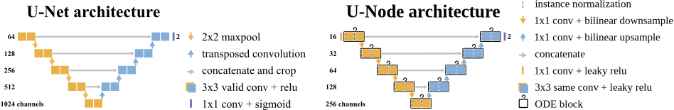
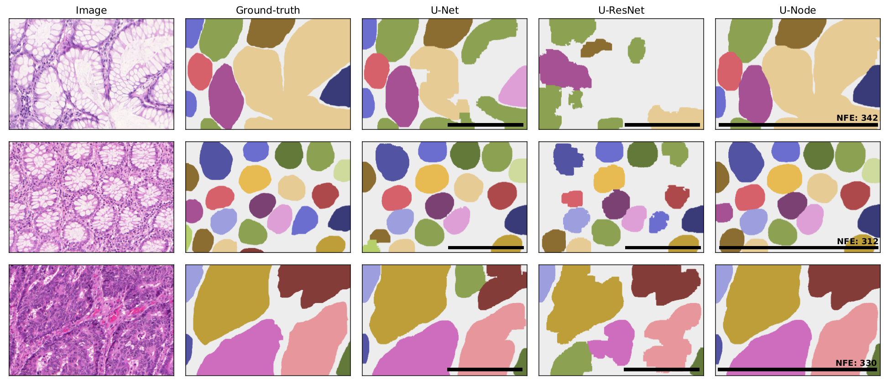

# Neural Ordinary Differential Equations for Semantic Segmentation of Individual Colon Glands

*Accepted to Medical Imaging meets NeurIPS workshop at NeurIPS 2019*

Automated medical image segmentation plays a key role in quantitative research
and diagnostics. Convolutional neural networks based on the U-Net architecture are
the state-of-the-art. A key disadvantage is the hard-coding of the receptive field size,
which requires architecture optimization for each segmentation task. Furthermore,
increasing the receptive field results in an increasing number of weights. Recently,
Neural Ordinary Differential Equations (NODE) have been proposed, a new type
of continuous depth deep neural network. This framework allows for a dynamic
receptive field at a constant memory cost and a smaller amount of parameters.
We show on a colon gland segmentation dataset (GlaS) that these NODEs can be
used within the U-Net framework to improve segmentation results while reducing
memory load and parameter counts.

This reposity contains the code to reproduce the experiments from our paper. 

**Tip: start with [the notebook](train_models.ipynb)**

[ArXiv link](https://arxiv.org/abs/1910.10470)

[Google Colab notebook](https://colab.research.google.com/drive/1JPuZhHWTWIlAnwdarFDhYYrHSt4YXK0C#forceEdit=true&sandboxMode=true) (please note: training is quite slow on Google Colab.)

## Requirements

- pytorch
- torchvision
- numpy
- cv2
- PIL
- matplotlib
- scikit-image
- scipy
- [torchdiffeq](https://github.com/rtqichen/torchdiffeq)

## Models

Schematic overview of U-Net and the proposed U-Node network. The U-ResNet architecture is
equivalent to U-Node except for the ODE blocks.

## Results

Example patches of the test set with clear differences between the models. Each color denotes a
gland. The black bar denotes the receptive field. NFE denotes the number of function evaluations in the network.
Difficult images (first and last row) seem to require more evaluations.
